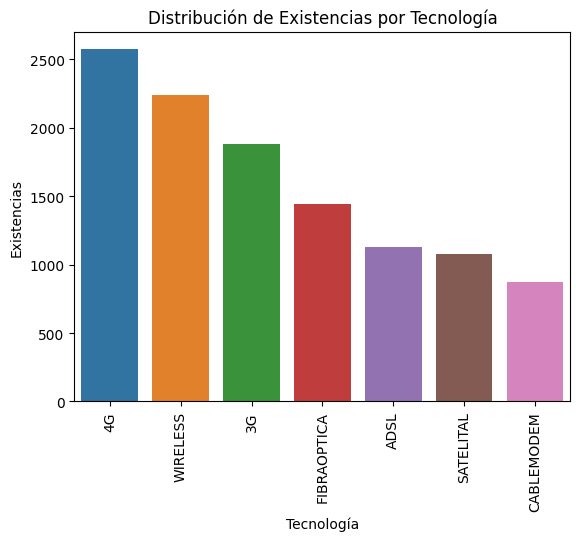
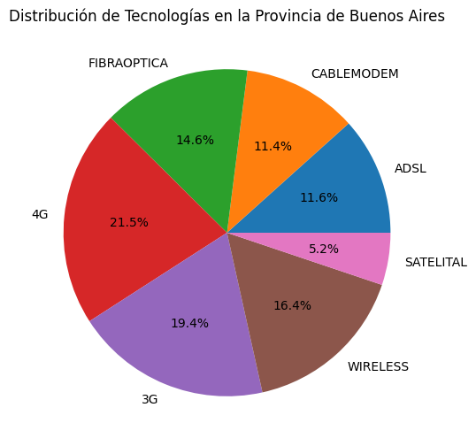
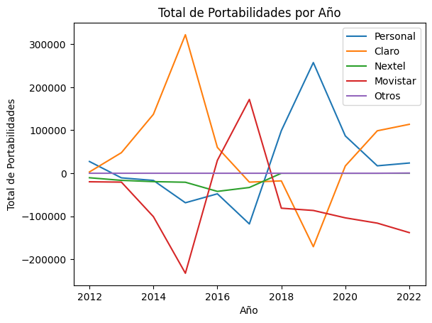
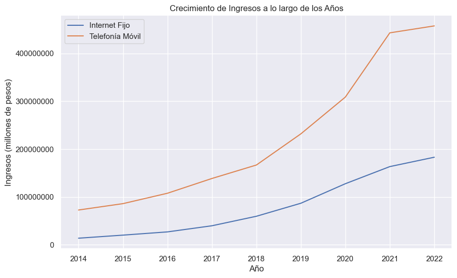
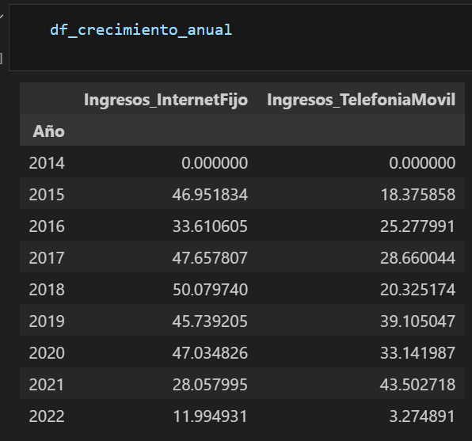

# ENACOM_Analytics

Análisis del sector de las telecomunicaciones, centrándose específicamente en Internet fijo, las tecnologías habilitadas y la telefonía móvil.

## Objetivo

El objetivo principal es examinar y comprender el estado actual del sector de las telecomunicaciones, identificando las tecnologías emergentes, las tendencias y los desafíos que enfrenta la industria. Además, se busca analizar el impacto de estas tecnologías en el acceso a Internet y la telefonía móvil.

## Herramientas

 

## Roadmap del Proyecto

### **Recopilación de datos** 
Recopilamos datos de la página web [Enacom](https://datosabiertos.enacom.gob.ar/home), sobre Internet Fijo y Telefonia móvil.

Datasets como numeros de accesos en ambos, cantidad de tecnologias hábiles en el país, portabilidad numérica deempresas de telefonía movíl e ingresos de ambos sectores.

### **Tecnologías Habilitadas**
- Exploración de las tecnologías emergentes en el campo de las telecomunicaciones, con un enfoque en Internet y la telefonía móvil.

### **Comparación de accesos** 
- Comparación entre ambos tipos de accesos(Internet Fijo y Telefonía Móvil) a lo largo de los años.

### **Ingresos en ambos sectores**
- Crecimiento de los ingresos de ambos sectores a lo largo de los años.

### **Telefonía Móvil portabilidad numérica** 
- Vemos como las empresas de de telefonía más usadas en el país ganan y pierden clientes a lo largo de loa años y como algunas se benefician de esto.

### **Conclusiones**

Podemos apreciar que las tecnologías más habilitadas dentro de sector de telecomunicaciones en Argentina son aquellas que se manejan por el sector móvil, en este caso el 4G y el 3G, las tecnologías Wireless le siguen pero ya se trata de algo mas general ya los mismo celulares se pueden considerar como tecnología Wireless, está presente en ambos sectores móvil y fijo(cablemodems, routers).

Cabría mencionar que la fibra óptica parecer ser la más predominante en el sector de cableado, por lo tanto un aumento en este sector no solo es previsto sino recomendable. En este ejemplo vemos mas de cerca las técnologias en Buenos Aires, por tener la concentración de estas mas alta.

**KPI**: Aumentar el porcentaje de fibra óptica un 2% para el año entrante. Para tener estar a la par con Wireless.

Al ser el sector móvil el mas predominante, hay que tener en cuenta que empresas son las más preferidas por los habitantes, para considerar una futura alianza con una o varias de estas buscando ofrecer los servicios de Internet que la empresa proporciona.

Para tener una idea de que empresas serían estas miramos la portabilidad numérica a lo largo de los años con sus altas y bajas por empresa.

Algunas de estas se benefician de la perdidad de números de otras.
Dos en particular Claro y Personal, quienes hasta el día de hoy se ven al alza, indicando una clara preferencia por el servicio de estas empresas.
Mientras que otras como Movistar no paran de perder números.

Y por último damos un vistazo a la evolución de los ingresos a lo largo de los años. Teniendo la Telefonía móvil una gran distancia en comparación con los ingresos del Internet Fijo.

**KPI**: Analizamos el crecimiento porcentual a lo largo de los años y ponemos como estimado de crecimiento por año la media estos. 

Media de crecimiento por año Internet Fijo: 35%
Media de crecimiento por año Telefonía Móvil: 24%

## Contacto:

